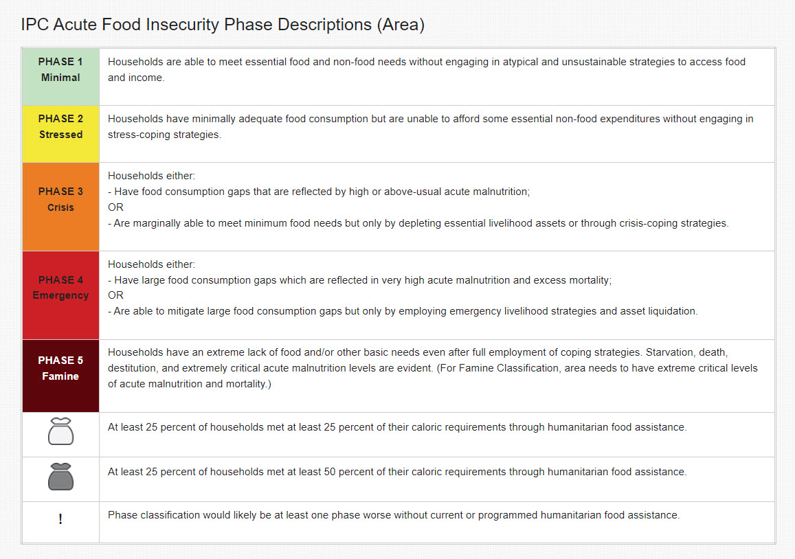
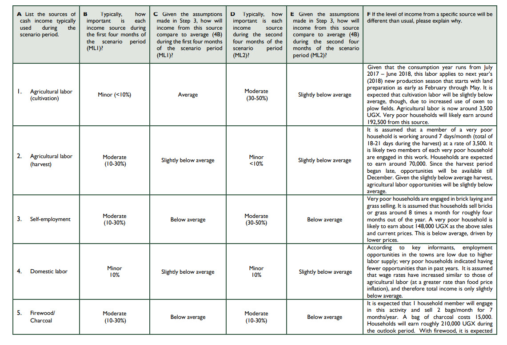
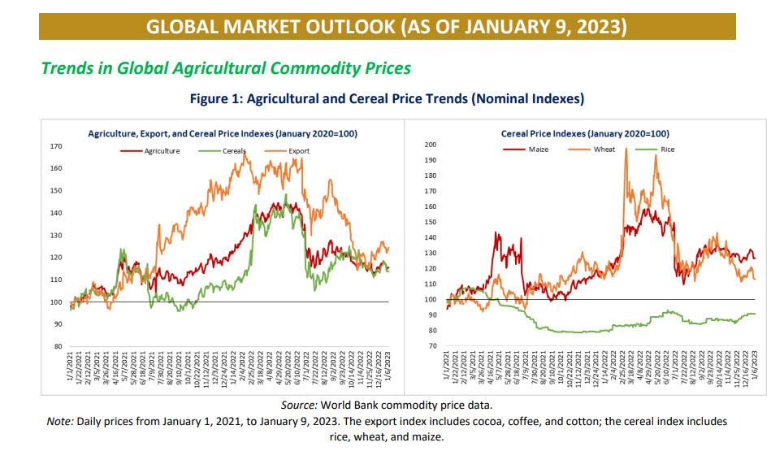
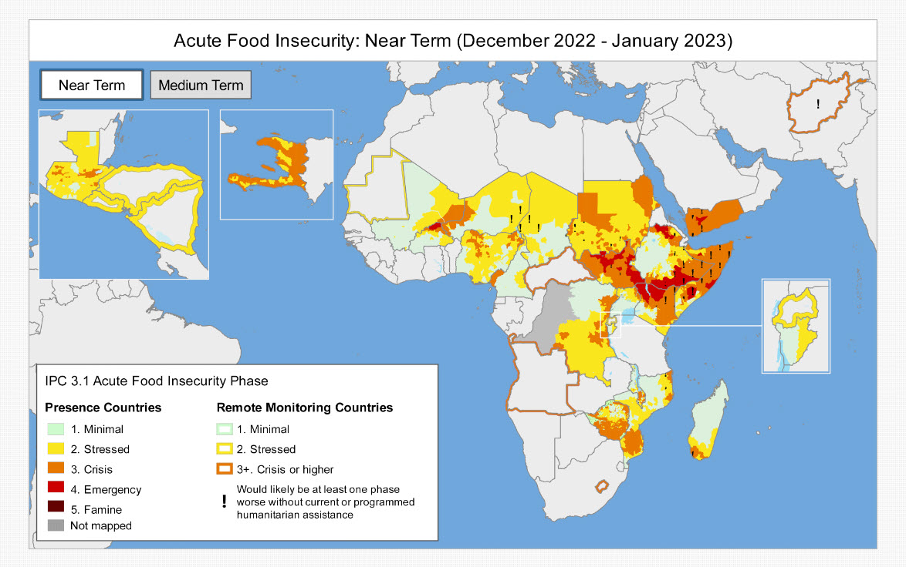
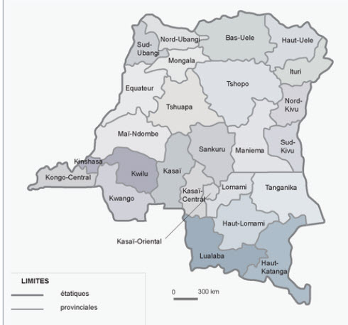

```{r, include=FALSE}
knitr::opts_chunk$set(echo = TRUE, warning=FALSE, message=FALSE)
```

## Case

Sharon Glazier, just put down her phone.


This posting has raised her already peaking anxiety for the success of a new engineering consulting practice she has been appointed to lead as managing director for Danish/German Keufel \&Esser Engineering (KEE). KEE has just acquired Sharon's company Watson \& Matlock Engineering (WME), where she was in charge of New Ventures, namely Africa. “We are very excited to be welcoming WME’s 1000 experts to KEE, especially their successful Africa venture,” KEE Group CEO Jens Abel had said. “Growing in Africa has been a strategic priority for us since we established our presence in 2012 with the successful acquisition of engineering firms in Ghana and Cameroon.”

The combined revenues of the KEE and WME will exceed \$5 billion employing . WME already had a thriving Americas practice with coverage in the U.S., Canada, Mexico and Brazil for consulting engineering services in agriculture, water, energy, environment and health. In the past four years WME has been providing USAID, UN Peacekeepers, and refugee service agencies with project design and management services. 

KEE's CEO Jens Abel has charged Sharon with growing the Africa engineering practice from 150 engineering consulManiemats to 900 in the next five years. Presently, Sharon's program managers supervise \$3.8 billion of World Bank and other public-privage projects in Southern Sudan, the Horn of Africa, and sub-Saharan Africa.

"What's in the way of growing our business?" Sharon asked her two program management leads, Marc Freneau and Hilda Kramer. "Food and energy," replied Marc. Hilda chimed in with "trade and inflation." Both replied in unison, "War."

Hilda is running two water purification projects in Zimbabwe. She reports, "Food inflation is over 300\%. My team and their families can barely afford to eat. The communities they live in are much worse off."

Sharon and her program leads know all too well that projects run on reliable supply chains, stable finance, and, of course, government stability. In the end it is all about people, their safety and ability to thrive, not just survive.

People are at the core of each of these requirements from ethical labor practices to the commitment of local, state, and federal government leaders. Increased bureaucracy and corruption are byproducts of the rich flows of foreign direct investment for large project undertakings. 
The team decides that food security, along with energy for later consideration, will be the key to near-term stability in the markets they serve. Without safety and stability their projects will be stalled, even abandoned, let alone be able to start up again. Project operations will be nearly impossible in the most impoverished, famine- and war-stricken areas. Sharon exclaims, "Projects run on people for people, not just technology."

Sharon orders her program leads to select a small, dedicated team to assess food security in Africa. Hilda points to an existing Famine Early Warning System with an Integrated Phase Classification framework. Marc proposes that the team use existing open data sources and analysis to construct their own food security monitoring dashboard. He notes,"we have boots on the ground in each of our markets." 

Sharon agrees with Hilda and Marc, "Let's at the very least explore what the data and the existing food security indicators can tell us about what is happening now, and what might happen next."

## Background

### Food (In)Security

Four dimensions: availability, access, utilization, and stability

#### Availability

“The amount of food that is present in a country or area through all forms of domestic production, imports, food stocks and food aid”. (WFP, 2009, p.170). Does simply producing more food result in availability? Not necessarily, since leaps in production occur in stricken countries.

#### Access 

“A household’s ability to acquire adequate amount of food regularly through a combination of purchases, barter, borrowings, food assisManiemace or gifts”. (WFP, 2009, p. 170).

There are three elements in the access to food: physical, financial and
socio-cultural.

- The physical aspect is logistical. Food supplied by one region might have limited transportation infrastructure linking a region demanding the food.

- The economic component is mainly financial. Where food is available and households have access, they may or may not have the income or credit to acquire on a regular basis enough food to meet their requirements.

- Socio-cultural barriers to the access of food even in the midst of plenty, and even with physical access. Some ethnic, gender, age, health status portions of the population might not have access due to membership in a group culturally kept from access. 

#### Utilization

Food utilization refers to “safe and nutritious food which meets their dietary needs.” (WFP)

Nutrition, including the safe production, handling, distribution, and storage of food, is linked to food security as there could not be any food security without proper nutrition. There are further considerations in nomenclature. For example, French and Spanish linguistic usage can conflate possible the distinctions between security and safety. For these languages there are no distinctions between food safety and food security expressed respectively as “sécurité alimentaire” (French) and “sicurezza alimentare” (Spanish). 

### Stability

No changes in security over time.

### Vulnerability

Food insecurity tends to be relatively easier to measure than security. It seems more easy to measure the answer to " do I have too little" than even to "do I have enough." Vulnerability can be expanded to capture a more complex relationship between
risks, ability to cope (actions taken before, during and after shocks) that affect
food security. When viewed in relation to the probability of experiencing
welfare loss caused by uncertain events, it also depends on the ability to
reduce risks before a shock occurs (proactive) and respond effectively during
and after they occur (reactive).
FAO defines vulnerability as the presence of factors that place people at risk of
becoming food insecure or malnourished including those factors that affect
their ability to cope. While WFP retains the following definition: “The
vulnerability to food insecurity is made of all the factors that constitute a risk
for people to become food insecure including factors that affect their capacity
to face the difficulty they meet. In other words vulnerability to food insecurity
relates to situations where there is a risk – in certain circumsManiemaces or
following some events or shocks (drought, disease, civil disturbance, etc.) –
that future food intake will be inadequate” but also the following definition
more simple: “Conditions that increase a household’s susceptibility to the
effects of hazards. It is a function of a household’s exposure to a hazard and
its coping capacity to mitigate the effect of that hazard”. (WFP, 2009, p. 172).

"Vulnerability can be ... defined in terms of exposure, capacity and potentiality. Accordingly, the prescriptive and normative response to vulnerability is to reduce exposure, enhance coping capacity, strengthen recovery potentiality and bolster damage control (ie minimize destructive consequences) via private and public means." (@Downing2004)

The World Food Program lists the key drivers of food crisis as economic, conflict, and climate vulnerabilities, external and internal to countries and regions.^[Page numbers from the _WFP Global Response Plan, Update \#6_, November 2022 <https://docs.wfp.org/api/documents/WFP-0000144405/download/?_ga=2.104812544.125234752.1676581626-345513674.1676581626>. ] 

- **Economic:** "While food prices have fallen over the past six months, they remain at a level last seen more than a decade ago. As of October 2022, 113 countries have year-on-year food inflation of 10 percent or more, and it exceeds 15 percent in 67 countries, including three countries with triple-digit food inflation rates. This means worsening conditions for people in acute food insecurity and a greater threat to the millions who are just making ends meet." (p. 7)

- **Conflict:** "In 2021, more than 70 percent of people facing Crisis or worse levels of acute food insecurity (IPC/CH Phase 3 and above) were living in conflict-affected countries. It is no coincidence that the nations with the highest numbers of people in catastrophic conditions all are currently suffering from violence or armed conflict. Since the start of 2022, the number of violent incidents globally has increased steadily month to month, with 12,430 events in September compared to 8,668 in January.23 This trend is predicted to continue to drive hunger into 2023 as increased geopolitical tensions mix with rising poverty, a gloomy economic outlook and increasing levels of social unrest." (p. 8)

- **Climate:** "The climate crisis is driving hunger like never before. From PakisManiema to Nigeria to Somalia, we see plainly the impact of the climate crisis on vulnerable communities across the globe. At the beginning of 2022, weather extremes were the main drivers of acute food insecurity in seven countries leading to 23.5 million people in Crisis levels or worse (IPC/CH Phase 3 or above)." (p. 8)

Vulnerability is a flaw, weakness, threat to the achievement of food security. It creates insecurity. A risk on the other hand is the probable exposure to a vulnerability, a danger. Examples of food security vulnerabilities include lack of safe physical food distribution and handling facilities, corrupt governance of organizations which manage food distribution, and cultural taboos which limit access to nutrition. 

Once we identify key vulnerabilities, we can assign specific risks as expectations of probable levels of the unavailability of, lack of access to, limited utilization of, and instability of meeting food requirements. Often risks are measured by appealing to the frequency, severity, and volatility of severity of incidents of food insecurity. In addition known early warning indicators of vulnerability and the impact of systemic flaws on increases in frequency, severity, and volatility could be identified and tracked. Identification of vulnerabilities with risk coordinates is greatly aided by a comprehensive a food system ontology such as _FoodOn_.^[FoodOn at <https://bioportal.bioontology.org/ontologies/FOODON/?p=summary>. A food risk ontology at @]

For example, given a key vulnerability in providing government finance to highly susceptible populations in remote areas, a risk might be the frequent inability of households to procure and store nutrition on a weekly basis for pregnant and nursing mothers. The frequency would be measured in the intensity of insManiemaces per week of low birth-weight babies; the severity in counts of low birth-weights babies; the volatility in the range of low birth-weight babies across households. 

### Food security (famine) classifications

[FEWS Integrated Phase Classification -- Scenario-based Approach. ](https://fews.net/sites/default/files/documents/reports/Guidance_Document_Scenario_Development_2018.pdf)



#### FEWS IPC Scenario-based Framework

FEWS employs a multi-step scenario-based approach to apply IPC predictions to specific regions. For example, here are the cutpoints for meeting IPC levels in one region.




#### Causal factors 

The IPC analytical framework employs a gross to net risk approach in the frame of vulnerabilities, hazards, and resilience. The gross risk are delimited by the interaction of vulnerabilities with hazards. The net risk is arrived at by considering risk mitigation, called here resilience.

[IPC Technical Manual](https://www.ipcinfo.org/fileadmin/user_upload/ipcinfo/manual/IPC_Technical_Manual_3_Final.pdf)

"According to the IPC, the interaction between hazards and vulnerabilities drives food insecurity. Thus, analysis of these interactions identifies the key drivers of food insecurity. Vulnerability is defined as a household’s exposure, susceptibility and resilience to specific hazards. According to the IPC, vulnerability analysis is mainly driven by an undersManiemading of: the livelihood strategies of households (how they obtain food and income, their common coping strategies, and expenditure patterns); the livelihood assets that households can rely on including financial, physical, human, social, and natural assets; and how policies, institutions and processes, gender, and mitigating factors positively or negatively affect or could affect their ability to successfully to shocks and ongoing conditions. Once the vulnerabilities are clearly understood, the impacts of shocks are assessed based on their severity, magnitude and occurrence or probability of occurring. Shocks can be phenomena that have occurred or may occur in the future. They include acute events or ongoing conditions that can be natural or human-made, including but not limited to droughts, floods, earthquakes, tsunamis, sharp price increases, energy or food shortages, war, civil unrest, and disease epidemics." (p. 30)

"[R]esilience is acknowledged as a factor that, together with exposure and susceptibility, determines the vulnerability of households to specific acute events and ongoing conditions. Consideration of resilience is ensured through the examination of livelihood strategies, assets and policies, institutions and processes." (p. 30) 

- "Food availability addresses whether food is actually or potentially physically present for purchase or acquisition for consumption, including: aspects of production, food reserves, imports, markets and transportation, and wild foods.

- "Once analysis on the presence of food has been conducted, the next question is how households will access food through different sources and whether this will be sufficient. The ability to access enough food will depend on physical access (e.g. crop/livestock production, gathering, fishing, and disManiemace to markets), financial access (e.g. purchasing power, and access to credit) and social access (e.g. social networks, gifts, and family support).

- "If food is available and households have access to it, the next question is whether households are fully utilizing the accessible food for an adequate nutrition and energy intake. Food utilization is usually a factor of food preferences, preparation, storage and access to an adequate quantity and quality of water.

- "Once the dimensions of availability, access and utilization are understood, the next question is whether the whole system is stable. A stable system should ensure that the households are and will be food-secure at all times, including during future forecasts. Stability problems of specific interest include those that have or will impact food security in the short term. Climatic, economic, social and political factors can all be a source of instability." (p. 31)

#### Trade Restrictions Inflame Food Crisis


[**Trade restrictions are inflaming the worst food crisis in a decade**](https://blogs.worldbank.org/voices/trade-restrictions-are-inflaming-worst-food-crisis-decade)

"The worst global food crisis in a decade was one of the top issues discussed at the 12th ministerial meeting of the World Trade Organization last month . It is a crisis made worse by the growing number of countries that are banning or restricting exports of wheat and other commodities in a misguided attempt to put a lid on soaring domestic prices. These actions are counterproductive—they must be halted and reversed. 

"The price of wheat, a key staple in many developing countries, has shot up by 34 percent since the Russian invasion of Ukraine in late February.  Other food costs have also risen. In response, as of early June, 34 countries had imposed restrictions on exports on food and fertilizers – a figure approaching the 36 countries that used such controls during the food crisis of 2008-2012. 

"These actions are self-defeating because they reduce global supply, driving food prices even higher. Other countries respond by imposing restrictions of their own, fueling an escalating cycle of trade actions that have a multiplier effect on prices.  

"Everyone is squeezed by food price inflation, but the poor are the hardest hit, especially in developing countries, where food accounts for half of a typical family’s budget. Moreover, developing countries are especially vulnerable because they tend to be net importers of food.  History leaves no doubt about what happens when food becomes scarce or unaffordable for the poorest people: the 2008 food crisis, for example, brought on a significant increase in malnutrition, particularly among children. Some studies showed school drop-out rates of as much as 50 percent among children from the poorest households.

"Actions to limit exports had a significant effect on food prices in the 2008 crisis, making matters worse. Research shows that if exporters had refrained from imposing restrictions, prices on average would have been 13 percent lower.  

"This time, the war in Ukraine is accelerating a price surge that started earlier as a result of unfavorable weather in key producing countries, the rapid economic recovery after the COVID-19 induced slump, and the growing costs of energy and fertilizers. The war has severely disrupted shipments from Ukraine, one of the world’s largest food suppliers . The country is also a major supplier of corn, barley, and sunflower seeds, which are used to make cooking oil – goods that can’t reach world markets because Ukraine’s  ports are blockaded . 

"The multiplier effect, whereby unilateral trade restrictions fuel additional policy activism and higher prices, is already visible. In March, Russia, the world’s No. 2 exporter of wheat with a 17.5 percent share by volume, announced a temporary ban on exports of wheat and other grains. It was followed by smaller exporters such as KazakhsManiema and Türkiye. As of early June, 22 countries had imposed restrictions on wheat exports, covering 21 percent of world trade in the grain. These restrictions led to a 9 percent increase in the price of wheat – about one seventh of the total increase in prices since the beginning of the war.  

"Export restrictions aren’t the only trade measures governments are undertaking in response to higher prices. Some countries are cutting duties or otherwise easing restrictions on imports. Chile, for example, increased discounts on customs duties on wheat. Ordinarily, permanently cutting import restrictions would be welcomed. But in a crisis, temporary reductions in import restrictions put upward pressure on food prices by boosting demand, just as export restrictions do in cutting supply.  

"Among the hardest hit by trade restrictions are developing economies in Africa, Asia, Latin America, and the Middle East. Bangladesh imports 41 percent of the wheat it consumers from the Black Sea region. For the Republic of Congo, the figure is 67 percent, and it is 86 percent for Lebanon. Given the extent of the dependence, immediate pain is likely for the people of these countries, because alternative suppliers will not be available in the near term. Rising prices will eventually create incentives for major agricultural exporters to expand production and replace some of the exports from the Black Sea region, but that will take time.  

"All told, monitoring by the World Bank Global Trade Alert suggests 74 export curbs such as taxes or outright bans have been announced or imposed on fertilizer, wheat, and other food products since the beginning of the year (98 counting the ones that have lapsed). Similarly, 61 liberalizing import reforms such as tariff cuts have been counted (70 considering the ones that have lapsed)."

#### A lack of resilience amplifies the impact of shocks like food-price spikes

From [World Economic Forum: Strategic Intelligence site](https://intelligence.weforum.org/topics/a1Gb00000015MIVEA2/key-issues/a1Gb00000015QsaEAE)

"True resilience means that people, their communities, and their institutions are able to withsManiemad or bounce back from severe shocks. The world is increasingly complex and volatile, and home to more frequent, intense, and interlinked disturbances and stressors - not least the COVID-19 pandemic and its resulting economic impacts, the Russian invasion of Ukraine and related food- and energy-price spikes, ongoing conflict and displacement in other regions of the world, worsening land degradation, more violent weather extremes related to climate change, and increasing demographic pressures (ageing populations in some locales, and young populations with too-few opportunities in others). A lack of resilience means that these shocks and stressors amplify each other and unfold in more brutal and damaging ways in many regions. In 2021, mounting shocks and inadequate resilience meant that an unprecedented 276 million people, in 81 different countries with World Food Programme operations, experienced acute food insecurity. For 2022, the WFP has predicted that higher food and fuel costs mean acute hunger in these countries will rise by 47 million people, or 17\%, if the war in Ukraine continues unabated.

"Around the world, it will be a serious challenge to adequately build up the necessary capacities of people, communities, institutions, and national governments to anticipate, prevent, absorb, and adapt to the damaging effects of traumatic events. Efforts to build much-needed resilience have included promoting more diversified livelihoods that feature income alternatives to activities such as farming, boosting access to markets in rural areas, fostering the strategic management of natural resources, increasing access to education and the attainment of skills necessary to adapt to crises, and increasing access to adequate financial and productive assets alongside the broader provision of basic services and social safety nets. 53\% of the global population, and 83\% of Africans, now go without social-protection benefits - and the related systems that can help achieve a zero-hunger world by addressing poverty and vulnerability, and thereby improving access to food. People who enjoy these protections can better cope with threats to food security, while addressing inequality by empowering women and girls can create more jobs for young people and help prevent vulnerability to malnutrition."

### Food Security Update

[Food Security Update Report.](https://thedocs.worldbank.org/en/doc/40ebbf38f5a6b68bfc11e5273e1405d4-0090012022/related/Food-Security-Update-LXXVI-January-12-2023.pdf)

"At a glance

- Since the last update on December 13, 2022, agricultural, cereal, and export prices have remained relatively
stable.

- Domestic food price inflation continues to remain high in almost all countries.
- The global economy is projected to grow by 1.7 percent in 2023 and 2.7 percent in 2024.
- Global food prices are expected to remain high.
- Countries that experience food crises absorb the largest volume of humanitarian financing.
- High fertilizer prices have become a significant obstacle to food production in many low-income countries.
- Food inflation during pregnancy and in the first years of a child’s life is associated with greater risk of child
wasting in the short run and stunting in the long run."



### Acutely stressed regions



[FEWS Net Areas of Highest Concern](https://fews.net/)

#### HORN OF AFRICA	

The ongoing 2.5-year drought is the most extensive and persistent drought event in decades, leading to crop failure, millions of livestock deaths, water scarcity, and soaring staple food prices. A sixth below-average rainy season is forecast in early 2023, which will likely prolong this humanitarian emergency until the next rains in late 2023. 

The October to December 2022 rainfall season concluded with widespread deficits of 25-55 percent. While deficits are less severe in some areas, quantities are insufficient to alleviate the cumulative, severe impact of the five-season drought on cropping and livestock conditions.

#### NORTHERN ETHIOPIA	

The peace agreement, which was formalized in early November 2022, has allowed for increased humanitarian assistance and the re-establishment of basic services; however, recovery of severely eroded livelihoods in Tigray, Afar, and Amhara will not occur quickly.

In November, prices of food and non-food goods in Tigray decreased due to increases in market supply; however, labor opportunities remain limited and wages remain low, which continues to result in low household purchasing power.  

#### SOUTH SUDAN	

Extensive flooding for the fourth consecutive year, coupled with ongoing conflict amidst deteriorating economic conditions, is driving persistently high levels of acute food insecurity in the country. Of particular concern are populations in areas with concurrent insecurity and floods, notably Jonglei and central Unity. 

Violent surges in conflict occurred in western Upper Nile, Greater Pibor Administrative Area, and Uror County of Jonglei in late December and early January. These events have caused civilian deaths, destruction and pillaging of property, and extensive displacement and hindered the delivery of humanitarian assisManiemace.


## World Bank projects

### Future of Food

[**Future of Food: Building Stronger Food Systems in Fragility, Conflict, and Violence Settings**
](https://www.worldbank.org/en/topic/agriculture/publication/future-of-food-building-stronger-food-systems-fcv)

STORY HIGHLIGHTS

- Two-thirds of the increase in global hunger since 2014 is due to increasing fragility, conflict, and violence (FCV)

- At the end of 2020 over 80 percent of acutely food-insecure people lived in Fragile and Conflict-affected Situations (FCS)

- Stabilizing and improving food systems can have a positive impact in FCVs settings, not just by preventing hunger, but by creating employment and building trust

### Shortage of Life's Essentials: media event

[The Human Cost of the Food and Fuel Crisis.](https://live.worldbank.org/events/annual-meetings-2022-food-energy)

"Even before the war in Ukraine, food and energy prices and global hunger were already on the rise due to the COVID-19 pandemic, climate change impacts, and conflicts. The first half of 2022 has witnessed one of the largest shocks to global food and energy markets that the world has seen in decades. While most countries are impacted by these shocks, poor households face the highest burden. 

"This event discussed actions that the international community needs to focus on to address both energy and food shocks. For energy, this includes transitioning to renewable energy. While for food security, there is the need to address the current crisis while at the same time building long-term resilience such as through climate-smart agriculture and innovations in fertilizers. There was an example from Gambia on their investment for an energy roadmap that includes alternative energy sources. Meanwhile, Egypt showcased the country’s efforts to increase agriculture resilience which helped mitigate impacts of the current food crisis."

## Local market pricing dynamics

We focus our initial, provisional, analysis on food price inflation. This is one of three factors immediately influencing food insecurity, the others being climate change, and political violence. Thus in this preliminary study, we hold climate change and political violence at given, but not expressed, levels, _ceteris paribus_.

The FEWS site houses a database of staple food, and food market and product support prices, wages, and other per unit data. We examine three local markets in eastern Democratic Republic on the Congo: Maniema, North Kivu, and South Kivu. 


They possess contiguous borders with one another and with the interior of the DRC (province Maniema) and the board of Rwanda (provinces North Kivu and South Kivu). 

Many staple food prices are collected monthly in the FEWS database. We pick the beans (mixed) all in CDF (Congo Democratique Franc) prices to explore three hypotheses:

1. Each market exhibits price volatility clustering (periods of low volatility followed by periods of high volatility).

2. Markets spill their volatility into one another, so that if Maniema experiences a period of high price volatility, then we might expect North or South Kivo to experience a change in the volatility of the mixed bean prices.

3. Market interactions (dyadic pairs) exhibit not only highly volatile spill over, but highly unpredictable.^[By volatile we mean expectations of deviations from trend, and thus the existence of calculable joint probability distributions in the sharing of market information. We measure volatility with statistical variance. By unpredictable, we mean uncertain, so that meaningful expectations cannot be, mainly because they do not exist, formed. We measure uncertainty with the propensity to observe price movements in the extreme tails of joint price distribution, in excess of pricing thresholds.] 

We begin by extracting data from the FEWS site, extracting the data to spreadsheets, and transforming the data into analytical views. Next we explore the properties of the transformed data. Specifically we calculate 12 month rolling standard deviations and correlations of prices in and between each province. We then attempt to measure the impact one market's volatility on another market's volatility. Finally we model three markets as three interactive cross-province markets in an attempt to measure the flow of pricing information between markets. 

These analyses can, in a principled way amenable to discussion and modification, indicate the most direof the markets in terms of their spillover vulnerabilities and the extreme influence of highly improbable, and uncertain food price movements. In this way, we contribute to an understanding of which markets, market products, and timing of market events, policy makers might prioritize.

### Some simple summaries

We use tabular and graphical depictions of the shapes of each of the correlation and volatility series. Here is the first routine to generate a tabular summary of the shape of within-month correlations. 

```{r, echo=TRUE, eval=TRUE}
library(tidyverse)
#
options(digits = 4, scipen = 999999)
#library(learnr)
library(rethinking)
library(rstan)
library(tidybayes)
library(cmdstanr)
#library(psych)
#library(ggplot2)
library(GGally)
library(lubridate)
library(tidyverse)
library(quantreg)
library(forecast)
library(tidyquant)
library(matrixStats)
#
#
symbols <- c("Maniema", "NKivu", "SKivu") 
# long format ("TIDY") price tibble for possible other work
price_tbl <- read_csv( "beans-drc.csv" )
return_tbl <- price_tbl %>% 
  group_by(symbol) %>% 
  tq_transmute(mutate_fun = periodReturn, period = "daily", type = "log", col_rename = "daily_return") %>%
  mutate(abs_return = abs(daily_return))
#str(return_tbl)
r_2 <- return_tbl %>% select(symbol, date, daily_return) %>% spread(symbol, daily_return)
r_2 <- xts(r_2, r_2$date)[-1, ]
storage.mode(r_2) <- "numeric"
r_2 <- r_2[, -1]
r_3 <- r_2 |>
  na.omit()
r_3 <- r_3[-1,]
#r_corr <- rollapply(r_3, 12, FUN = cor) #[,c(2, 3, 6)]
library(zoo)
r_corr_12 <- rollapply(r_3, width=12, function(x) cor(x[,1],x[,2]), by.column=FALSE)
r_corr_13 <- rollapply(r_3, width=12, function(x) cor(x[,1],x[,3]), by.column=FALSE)
r_corr_23 <- rollapply(r_3, width=12, function(x) cor(x[,2],x[,3]), by.column=FALSE)
r_corr <- cbind( r_corr_12, r_corr_13, r_corr_23 ) 
colnames(r_corr) <- c("Maniema_NKivu", "Maniema_SKivu", "SKivu_NKivu")
r_vols <- rollapply(r_3, 12, FUN = colSds)
colnames(r_vols) <- c("Maniema", "SKivu", "NKivu")
# de-xts()
#
corr_tbl <- r_corr |> 
  as_tibble() |> 
  mutate(date = index(r_corr)) 
corr_tbl <- corr_tbl[-(1:11), ] |> 
  gather(
    key = market, 
    value = corr, -date
    )
vols_tbl <- r_vols |>
  as_tibble() |> 
  mutate(date = index(r_vols)) 
vols_tbl <- vols_tbl[-(1:11),] |> 
  gather(
    key = market, 
    value = vols, -date
    ) 
corr_vols <- merge(r_corr, r_vols)
corr_vols_tbl <- corr_vols %>% as_tibble() %>% 
  mutate(date = index(corr_vols))
#
#write_csv(corr_vols_tbl, "corr_vols_tbl.csv")
```

```{r}
corr_tbl %>% group_by(market) %>% 
  summarise(mean = mean(corr, na.rm=TRUE), 
            sd = sd(corr, na.rm=TRUE), skew = skewness(corr, na.rm=TRUE), 
            kurt = kurtosis(corr, na.rm=TRUE), 
            min = min(corr, na.rm=TRUE), 
            q_25 = quantile(corr, 0.25, na.rm=TRUE), 
            q_50 = quantile(corr, 0.50, na.rm=TRUE), 
            q_75 = quantile(corr, 0.75, na.rm=TRUE), 
            max = max(corr, na.rm=TRUE),
            iqr = quantile(corr, 0.75, na.rm=TRUE) - quantile(corr, 0.25, na.rm=TRUE)
            )
```

We just reuse the code above and substitute `vols` for `corr` to review the volatility data.

```{r vols-ex-summ, eval = TRUE, echo = TRUE}
vols_tbl %>% group_by(market) %>% 
  summarise(mean = mean(vols, na.rm=TRUE), 
            sd = sd(vols, na.rm=TRUE), 
            skew = skewness(vols, na.rm=TRUE), 
            kurt = kurtosis(vols, na.rm=TRUE), 
            min = min(vols, na.rm=TRUE), 
            q_25 = quantile(vols, 0.25, na.rm=TRUE), 
            q_50 = quantile(vols, 0.50, na.rm=TRUE), 
            q_75 = quantile(vols, 0.75, na.rm=TRUE), 
            max = max(vols, na.rm=TRUE),
            iqr = quantile(vols, 0.75, na.rm=TRUE) - quantile(vols, 0.25, na.rm=TRUE)
            )
```

We view densities and line plots of historical correlations with these routines.

```{r explorecorr}
corr_tbl %>% ggplot(aes(x = corr, fill = market)) + 
  geom_density(alpha = 0.4) + 
  xlab( "bean (mixed) price correlation") +
  facet_wrap(~market)
#
corr_tbl %>% ggplot(aes(x = date, y = corr, color = market)) +
  geom_line() + 
  xlab( "bean (mixed) price correlation") +
  facet_wrap(~market)
#
```

These plots not only support the summary statistics, but they also illustrate the phenomenon of volatility clustering effectively.

We use the right column of `vols_tbl`, namely, `vols`.

```{r vols-ex, eval = TRUE, echo = TRUE}
#
vols_tbl %>% ggplot(aes(x = vols, fill = market)) + 
  geom_density(alpha = 0.4) + 
  xlab( "bean (mixed) price volatility") +
  facet_wrap(~market)
#
vols_tbl %>% ggplot(aes(x = date, y = vols, color = market)) +
  geom_line() + 
  xlab( "bean (mixed) price volatility") +
  facet_wrap(~market)
#
```

These initial forays into exploring the data clearly indicate the highly volatile nature both of correlation and volatility. The shape of the data shows prominent right skews and potentially thick tails as well. All of these point to the same stylized facts of commodity market returns globally, but now in evidence in local markets.

### Do volatility and correlation persist?

with the `Maniema_NKivu` interactions and using the ggplot2 function `ggtsdisplay()` from the `forecast` package, we get all of this at one stop on the way.

```{r persistcorr,}
Maniema_NKivu <- r_corr$Maniema_NKivu
forecast::ggtsdisplay(Maniema_NKivu, lag.max=30, plot.type = "histogram")
```

Do correlations persist? There is strong monthly persistence to 10 month lags. The variability of correlation varies only in the negative direction: a low current correlation would seems to be strongly influenced by a high correlation up to 10 months prior.

- The distribution seems skewed to the left and non-normal.

We check the  `Maniema` market volatilities next. 

```{r persistvols-ex, eval = TRUE, echo = TRUE}
Maniema <- r_vols$Maniema
forecast::ggtsdisplay(Maniema,lag.max=30, plot.type = "histogram")
```

Does volatility persist? As with correlation, strong and persistent lags over 10 months shows slow decay. Is this some evidence of market memory of risk? Perhaps, but it also indicates in this monthly time interval influences of outliers in the third scatter panel and variability seen in the first time series panel.

Overall, for correlation and volatility we do see recurring patterns which indicate a regularity, an intelligibility we might call stylized in this local market data.

### Do markets spill into one another? 

Market spillover occurs when the volatility of one market's prices, through enManiemaglement[^enManiemagle], affects the volatility of another market's prices. We have three individual markets, Maniema, North Kivu (NKivu), and South Kivu (SKivu), all interacting with one another to form dyadic markets informationally, if not also physically with trade among the markets. We are not asking why, just the question of whether we observe spillover. If North Kivu bean prices are volatile, will Maniema be affected? If so, unanticipated trading strategies in one market (North Kivu) will informationally cause unanticipated movements in another (Maniema), here coupled through correlational structures.For example households in Maniema might have very narrow price bands for beans in their household budgets, while households in North Kivu will regularly substitute corn for beans in meal preparation.

[^enManiemagle]: This is a term from quantum mechanics when the state of the system (the market here) is indeterminate but nonetheless components are correlated. See David @Orrell2020quantum to peer into these ideas.

Let's examine this idea with a simple scatter matrix.

```{r pairs-mnk-nk}
corr_vols <- merge(r_corr, r_vols)
corr_vols_tbl <- corr_vols %>% as_tibble() %>% 
  mutate(date = index(corr_vols)) 
ggpairs(corr_vols_tbl[, c("Maniema_NKivu", "NKivu")])
```

There appears in the scatterplot a mixture of two market interactions. One is a fairly flat cluster, the other much stronger in spillover impact. The overall correlation averages the two behaviors.

What do we observe?

1. Are they apparently normally distributed? Not at all, apparently. We observe a negative skew in correlation and the characteristically positive skew in volatility.

2. What do the outliers look like in a potential relationship between correlations and volatility? The scatter plot indicates potential outliers in very high and very low correlation market environments.

3. Are there potentially multiple regions of outliers? Yes, in very high and low correlation environments. The body of the relation appears to have a positive impact in line with a fairly high correlation over 0.30.

## Quantile regression thoughts

With the existence of outliers in multiple regions we might consider a technique that respects this situation. That technique is quantile regression using the `quantreg` package. Quantile regression (@Koenker2005) can help us measure the impact of high stress episodes on markets, modeled as high and low quantiles.[^tutorial] 

[^tutorial]:  Here is a [tutorial on quantile regression](https://turing.manhattan.edu/~wfoote01/finalytics/primer-quantile-regression.html) that is helpful for the formulation of models and the interpretation of results.

- Just like `lm()`for Ordinary Least Squares (OLS), we set up `rq()` with left-hand side (correlations) and right hand side variables (volatilities).

- We also specify the quantiles of the left-hand side to identify outliers and the median of the relationship using the `taus` vector. Each value of `tau` will run a separate regression.

We run this code for one combination of correlations and volatilities. We can modify `y` and `x` for other combinations, and thus, other markets. A log-log transformation can help us understand the relationship between markets as the elasticity of correlation with respect to volatility.

```{r quantile, exercise = TRUE}
library(quantreg)
taus <- c(0.25, 0.50, 0.75) # quantiles of y for a 95% confidence interval
corr_vols_tbl <- na.omit(corr_vols_tbl)
y <- corr_vols_tbl$Maniema_NKivu; x <- corr_vols_tbl$NKivu
fit_corr_vols <- rq(log(y) ~ log(x), tau = taus)
fit_summary <- summary(fit_corr_vols)
fit_summary
plot(fit_summary)
```

The plot depicts the parameter estimate (intercept and slope) on the vertical axis and the quantile of correlation on the horizontal axis. The gray range is the 95\% confidence interval of the parameter estimates. The dashed red lines depict the ordinary least squares regression confidence intervals.

We might ask further questions of this analysis.

1. When is it likely for markets to spill over? Mostly across low to high correlation quantiles.

2. At what likelihood of correlations are market spillovers most uncertain? Again in very low and  very high correlation quantile regions.

3. What about the other markets and their spillover effects?

4. What should regional policy makers glean from from these results?

The last two questions deserve further analysis, which means more regressions. The policy maker can get an idea that preparing for market risk is a very high risk-management priority.

One more plot to tie up the market spillover questions.

```{r rqplot, exercise = TRUE}
p <- ggplot(corr_vols_tbl,  aes(x = NKivu, y = Maniema_NKivu)) +
    geom_point() + 
    ggtitle("Maniema-NKivu Interaction") + 
    geom_quantile(quantiles = c(0.10, 0.90)) + 
    geom_quantile(quantiles = 0.5, linetype = "longdash") +
    geom_density_2d(colour = "red")  +
    xlab( "North Kivu bean price volatility") +
    ylab( "Maniema-North Kivu price correlation")
p
```

To tailor this picture a bit, we can use `+ ylim(0.25, 1)` to specify the y-axis limits. The dashed line depicts the 50th quantile.

To what degree do our conclusions change when we perform similar analyses on the other market interactions? We just need to re-run the same script with the other market dyads. 

## Bayesian thoughts

Alternatively, we can examine the impact of the riskiness of one market on the other using a probabilistic model. Up to this point we have implemented a robust, albeit in a frequentist mood, model of market interaction. This allows us to form a binary hypothesis: $H_0$ no spillover, and $H_1$ spillover. We might question the acceptance or rejection of hypotheses based on the probability emphasis of the null hypothesis. We might also observe overlap of the probability that either might occur. 

This objection raises the issue of prior expectations about the hypotheses. If we assume that each is equally probable, perhaps $Beta$ distributed then we could let the likelihood of each hypothesis directly impact our inference. If we were to update priors with posteriors, we might also be able to tune the inference further.

Inherently these are not complex models as they have a single regressor acting on a dependent variable. Built into each variate are several assumptions about the variability and co-variability of returns. We might ask next what is the industry structure of spillover effects, at least as represented by these three segments of the renewables market. 

We propose this generative model.

\begin{align}
\rho_{[i]} & \sim \operatorname{Normal}(\mu_{\rho}, \sigma_{\rho}) \\
\mu_{\rho [i]} &= \alpha_{[i]} + \beta_{[i]} \sigma_{[i]} \\
\alpha_{[i]} & \sim \operatorname{Normal}(0,1) \\
\beta_{[i]} & \sim \operatorname{Normal}(0,1) \\
\sigma_{\rho [i]} & \sim \operatorname{Exp}(1) \\
\end{align}


The three markets are indicated by $[i]$, with $\rho$ and $\sigma$ the within-month correlation and market volatility, $\mu_{\rho}$ and $\sigma_{\rho}$ the expected value and volatility of the relationship between within-month correlation and market volatility. This formulation allows a mixed-random effects hierarchical model of the probable market risk infrastructure.

```{r quap-spill-Maniema-NKivu}
library(rethinking)
y <- corr_vols_tbl$Maniema_NKivu; x <- corr_vols_tbl$NKivu
d_1 <- tibble(
  Maniema_NKivu = log(y),
  NKivu = log(x)
)
d_1 <- na.omit(d_1)
m_1 <- quap(
  alist(
    Maniema_NKivu ~ dnorm( mu, sigma ),
    mu <- a + b*NKivu,
    a ~ dnorm( 0, 1 ),
    b ~ dnorm( 0, 1 ),
    sigma ~ dexp( 1 )
  ),
  data = d_1
)
precis( m_1 )
```

Priors are proper to the generation of the dependent variable. They can also take on positive or negative signs. Spillover is much in evidence here through size of impact and direction. Let's repeat this for the Maniema-SKivu and SKivu-NKivu markets separately.

```{r quap-spill-Maniema-SKivu, exercise=TRUE}
#library(rethinking)
y <- corr_vols_tbl$Maniema_SKivu; x <- corr_vols_tbl$SKivu
d_2 <- tibble(
  Maniema_SKivu = log(y),
  SKivu = log(x)
)
d_2 <- na.omit(d_2)
m_2 <- quap(
  alist(
    Maniema_SKivu ~ dnorm( mu, sigma ),
    mu <- a + b*SKivu,
    a ~ dnorm( 0, 1 ),
    b ~ dnorm( 0, 1 ),
    sigma ~ dexp( 1 )
  ),
  data = d_2
)
precis( m_2 )
```

A similar impact is indicated here, but in opposite sign. Now for the last pair, NKivu_SKivu.

```{r quap-spill-NKivu-SKivu}
#library(rethinking)
y <- corr_vols_tbl$SKivu_NKivu; x <- corr_vols_tbl$SKivu
d_3 <- tibble(
  NKivu_SKivu = log(y),
  SKivu = log(x)
)
# there are inf values here
is.na(d_3) <- do.call(cbind,lapply(d_3, is.infinite))
d_3 <- na.omit(d_3)
m_3 <- quap(
  alist(
    NKivu_SKivu ~ dnorm( mu, sigma ),
    mu <- a + b*SKivu,
    a ~ dnorm( 0, 1 ),
    b ~ dnorm( 0, 1 ),
    sigma ~ dexp( 1 )
  ),
  data = d_3
)
precis( m_3 )
```

North and South Kivu have significant, but not highly elastic spillover effects. All of the models have similarities to the quantile regressions.

Pareto-Smoothed Importance Sampling and cross validation with the Leave-One-Out approach yield a trade-off between spillover variability and bias on the y-axis and uncertainty on the x-axis. Thick-tailed, skewed returns distributions become intelligible with this analysis. The extreme uncertainty of outliers (known-unknowns from $k$ = 0 to 0.7; unknown-unknowns for $k$ > 0.7 in tests reported by @GelmanHwangVehtari2013 and @VehtariGelmanGabry2015 ) contribute to the ability of the NKivu market to spill its uncertainty into the high variations of the Maniema market all through the naive mechanism of correlation.^[Power law distributions notoriously do not possess first, second, third, or even fourth moments analytically across the GPD parameter space, especially for $k$ (see @Embrechts2000 for examples). @Watanabe2009 develops a theory of statistical learning through which singularities in the space of estimation parameters imply that standard inference using Central Limit Theorems, Gaussian distributions, are inadmissable. The existence of divergence, at least as made intelligible through singularity theory, means we should rely on the more robust median, mean absolute deviation, and inter-quartile ranges (probability intervals) to summarize the outcomes of power law distributions. All of this also aligns well with Taleb's many warnings, examples, and inferences by @Taleb2018.]

```{r psis-k-penalty }
## R code 7.34 McElreath2020
#library( plotly )
options( digits=2, scipen=999999)
d <- d_1
set.seed(4284)
m <- m_1
PSIS_m <- PSIS( m, pointwise=TRUE )
PSIS_m <- cbind( PSIS_m, Maniema_NKivu=d$Maniema_NKivu, NKivu=d$NKivu )
set.seed(4284)
#WAIC_m2.2 <- WAIC(m2.2,pointwise=TRUE)
p1 <- PSIS_m |>
  ggplot( aes( x=k, y=penalty ) ) +
  geom_point( shape=21, color = "blue" ) + 
  xlab("PSIS Pareto k") + ylab("PSIS penalty") + 
  geom_vline( xintercept = 0.7, linetype = "dashed") + 
  ggtitle( "NKivu spills over into Maniema" )
p1 #ggplotly( p1 )
```

Here are the Maniema-SKivu outlier results.

```{r psis-spill-Maniema-SKivu}
## R code 7.34 McElreath2020
library( plotly )
options( digits=2, scipen=999999)
d <- d_2
set.seed(4284)
m <- m_2
PSIS_m <- PSIS( m, pointwise=TRUE )
PSIS_m <- cbind( PSIS_m, Maniema_SKivu=d$Maniema_SKivu, NKivu=d$SKivu )
set.seed(4284)
#WAIC_m2.2 <- WAIC(m2.2,pointwise=TRUE)
p1 <- PSIS_m %>% 
  ggplot( aes( x=k, y=penalty ) ) +
  geom_point( shape=21, color = "blue" ) + 
  xlab("PSIS Pareto k") + ylab("PSIS penalty") + 
  geom_vline( xintercept = 0.7, linetype = "dashed") + 
  ggtitle( "SKivu spills over into Maniema" )
p1 #ggplotly( p1 )

```

and

```{r psis-spill-SKivu-NKivu-0}
#library( plotly )
options( digits=2, scipen=999999)
d <- d_3
set.seed(4284)
m <- m_3
PSIS_m <- PSIS( m, pointwise=TRUE )
PSIS_m <- cbind( PSIS_m, NKivu_SKivu=d$NKivu_SKivu, SKivu=d$SKivu )
set.seed(4284)
#WAIC_m2.2 <- WAIC(m2.2,pointwise=TRUE)
p1 <- PSIS_m %>% 
  ggplot( aes( x=k, y=penalty ) ) +
  geom_point( shape=21, color = "blue" ) + 
  xlab("PSIS Pareto k") + ylab("PSIS penalty") + 
  geom_vline( xintercept = 0.7, linetype = "dashed") + 
  ggtitle( "NKivu spills over into SKivu" )
p1 #ggplotly( p1 )

```

Our next stop is to look at the joint probability of spillover effects across the three markets.

### Market risk infrastructure

We  now invoke the full generative model, including the jointly considered markets. We index each market and consider all of the impact parameters as jointly determined. They thus share information across markets through the total probability of observing all three markets in the presence of all of the market interaction parameters.

```{r markets}
#library(rethinking)
corr_vol_spill <- read_csv( "market-connectivity.csv" )
d_4 <- tibble(
    corr = corr_vol_spill$corrs,
    vol = corr_vol_spill$vols,
    mid = corr_vol_spill$mids
  )
d_4 <- na.omit(d_4)
#log vols and (abs) corrs will allow us to interpret coefficients as elasticities
```

Here is Stan code to estimate individual and joint market effects.

```{r eval=FALSE }
model_1 <- 
"data{
int N;
int M;
vector[N] y;
vector[N] x;
int cid[N];
}
parameters{
vector[M] a;
vector[M] b;
vector[M] <lower=0> sigma;
}
model{
vector[N] mu;
sigma ~ exponential( 1 );
b ~ normal( 0 , 1 );
a ~ normal( 1 , 1 );
for ( i in 1:N ) {
mu[i] = a[cid[i]] + b[cid[i]] * x;
}
y ~ normal( mu , sigma );
}

"
```

This routine uses the Stan code and our highly transformed data to estimate market spillover between and among pairs of markets.

```{r eval=FALSE}
library(rethinking)
m_4 <- ulam(
  alist(
    corr ~ dnorm( mu[mid], sigma[mid] ),
    mu <- a[mid] + b[mid] *vol,
    a[mid] ~ dnorm( 0, 1 ),
    b[mid] ~ dnorm( 0, 1 ),
    sigma[mid] ~ dexp( 1 )
  ),
  data = d_4, log_lik=TRUE
)
precis( m_4, depth = 2 )
#save( m_4, file="spill-all")
#stancode( m_4 )
#options( digits = 2 )
#cov2cor( vcov( m_4 ) )
```

```{r}
load( file="spill-all")
precis( m_4, depth = 2 )
#

```

The Bayesian approach integrates the marginal parameters for each of the markets by using the total probability of observing the data across the markets and the range of potential parameter values. Thus the parameters share information across markets for systematic and ideosyncratic components. 

This helper function based on the `cowplot` package will place two plots side-by-side, much like a `ggplot2` facet.

```{r fig-industry, echo=TRUE}
#
# draw marginal samples for parameters
#
# ggplot helper
library(cowplot) 
plot_2_grid <- function( plot1, plot2, title_1= "Default" ){ 
    # build side by side plots
    plot_row <- plot_grid(plot1, plot2)
    # now add the title
    title <- ggdraw() + 
    draw_label(
      title_1,
      fontface = 'bold',
      x = 0,
      hjust = 0
    ) +
    theme(
      # add margin on the left of the drawing canvas,
      # so title is aligned with left edge of first plot
      plot.margin = margin(0, 0, 0, 7)
    )
    plot_grid(
    title, plot_row,
    ncol = 1,
    # rel_heights values control vertical title margins
    rel_heights = c(0.1, 1)
    )
}
```

The comparison of slope impact parameters across the three markets in the left panel indicates the high plausibility of information sharing across the markets on a systematic basis. In the right panel are the sManiemadard deviations, a measure of the shared information of an unsystematic nature. The joint distribution of these marginal parameters indicate a high degree of sharing of return volatility among the markets.

```{r }
library(tidybayes.rethinking)
m_draws <- m_4 |>
  spread_draws( a[mid], b[mid], sigma[mid] )
mid <- as.factor(m_draws$mid)
levels(mid) <- list( "Maniema_NKivu"=1, "Maniema_SKivu"=2, "NKivu_SKivu"=3 )
m_draws$mid <- mid
# plot grid of two parameters
p1 <- m_draws |>
  ggplot(aes(x = b, y = as.factor(mid) ) ) +
  stat_halfeye( color = "blue") +
  xlab("volatility spill into correlation ") + ylab("market") +
  xlim( -2.0, 2.0) + 
  geom_vline( xintercept = 0.23 , linetype = "dashed") + geom_vline( xintercept = 4.00, linetype = "dashed")
# build sigma_V comparison
p2 <- m_draws |> 
  #filter( sigma < 0.2) %>%  
  ggplot(aes(x = sigma, y = as.factor(mid) ) ) +
  stat_halfeye( color = "blue") +
  xlab("unanticipated spillover") + ylab("market") +
  xlim( 0.20, 0.50) +
  geom_vline( xintercept = 0.12 , linetype = "dashed") + geom_vline( xintercept = 0.165, linetype = "dashed")
plot_2_grid( p1, p2, title_1 = "Impact of volatility on correlation")
#
#ggsave( "compare.png" )
p2
```

To ground us in a more practical answer. We can say that a 10\% move either in NKivu or SKivu volatility will induce at least a 30\% in the volatility of Maniema, with moves as low as about 20\% and as high as about 45\%. A 10% move in NKivu will induce a bit more than an 18\% move in SKivu, with moves as low as 6\% and as high as over 30\%. These intervals are credible with 89\% probability.

Again we can review the role of each of the observations on the bias-uncertainty tradeoff. High penalty-high $k$ observations will obscure efforts to predict correlations. The market to watch in this regard is the NKivu-SKivu pair, which coincides with the high volatilities both of SKivu and NKivu evident in the $\sigma$ distributions we viewed above. 

```{r psis-spill-SKivu-NKivu-1}
## R code 7.34 McElreath2020
#library( plotly )
options( digits=2, scipen=999999)
d <- d_4
set.seed(4284)
m <- m_4
PSIS_m <- PSIS( m, pointwise=TRUE )
PSIS_m$market <- c( rep( "Maniema-North Kivu", 114 ), rep( "Maniema-South Kivu", 114 ), rep( "North Kivu-South Kivu", 114 ) ) 
set.seed(4284)
#WAIC_m2.2 <- WAIC(m2.2,pointwise=TRUE)
p1 <- PSIS_m |> 
  ggplot( aes( x=k, y=penalty, fill = market, color = market ) ) +
  geom_point( shape=21 ) + 
  xlab("Uncertainty: PSIS Pareto k") + ylab("Risk: PSIS penalty") + 
  geom_vline( xintercept = 0.7, linetype = "dashed") + 
  ggtitle( "Local market risk and uncertainty" )
p1 #ggplotly( p1 )
```

Most of the uncertainty is found in North Kivu volatility on Maniema (green). The least uncertain market seems to be the relationship between South Kivu and North Kivu.

Finally, at least for this exercise, we can compare the Wide Area Information Criterion, also known as the Watanabe-Akaike Information Criterion, or WAIC for short, of covariance and non-covariance dependent models of market structure.[^WAIC-expl]

[^WAIC-expl]: PSIS exploits the distribution of potentially outlying and influential observations using the GPD to model and measure the data point-wise with the shape  parameter $k=\xi$. Any point with $k>0.5$ will  have infinite variance and thus contribute to a concentration of points -- the thick tail. Related to this idea, WAIC is the _*log-posterior-predictive density*_ ( _lppd_, that is, the Bayesian deviance) and a penalty proportional to the variance in posterior predictions:
$$
WAIC(y, \Theta) = -2(lppd - \underbrace{\Sigma_i var_{\theta}\,log  \,\,p(y_i|\theta))}_{penalty}
$$
The penalty is related to the number of free parameters in the simulations, as @Watanabe2009 demonstrates.

```{r compare-tab-static}
comp <- compare( m_3, m_4 )
knitr::kable(head(comp), format = "latex", caption = "WAIC comparison.") %>% 
  kableExtra::kable_styling(font_size = 7)
```

# What have we accomplished?

We can provide provisional answers to a policymaker's initial questions using the work flows developed here.

- Univariate volatility clustering is compatible with high kurtosis, and thus highly volatile volatility.

- Volatile volatility in each asset spills into each market separately. These affects are measured using both quantile regression and Bayesian statistical techniques. The two approaches seem to agree on the probable existence of market spillover.

- We tested the hypothesis that one market's riskiness affects another market, probably. They do, both in systematic, $\beta$, and idiosyncratic, $\sigma$, modes. 

- We find that a strongly coupled market risk structure persists across Maniema, SKivu and NKivu assets in each pair of market combinations.

- Maniema is the most sensitive market with highly volatile responses to NKivu and PBS volatility. Both NKivu and SKivu are far less sensitive to moves within and across their markets.

The CFO should be wary that strong negative movements in one market will probably persist and spill over into negative movements across the three markets. Earnings based on this model will themselves exhibit the results of volatility clustering and market spillover.

Our next step could well be to build volatility clustering, and other thick-tailed outcomes, to derive implied capital requirements through market risk channels. Such requirements would inform the risk budgeting assignments that might be built into delegations of authority, portfolio limits, even into optimization constraints.

# References
